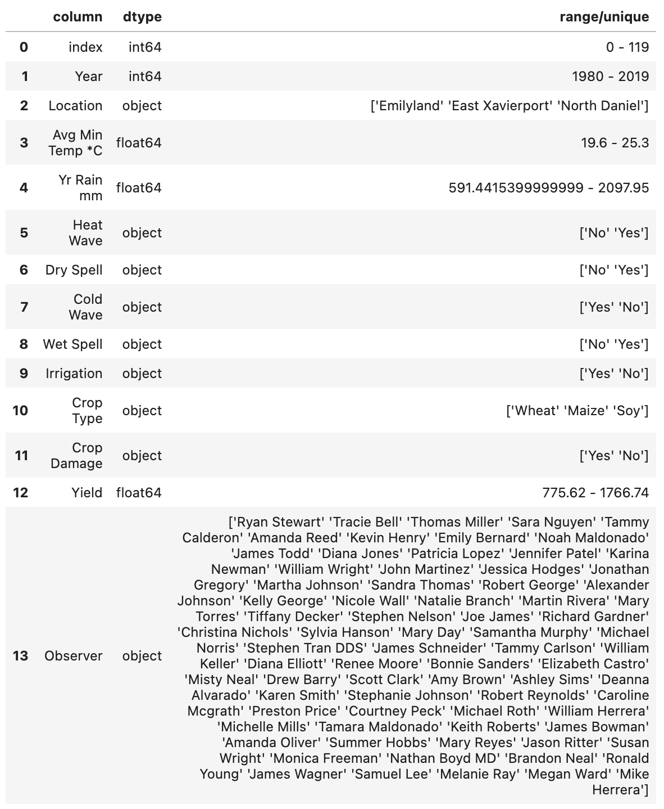

# Analysing Agricultural Yield through Data Analytics

This project was part of my study in the unit of Introduction to Data Science. The dataset was artificial generated about **agriculture** containing these features:

The target of the analysis and prediction was **Yield**. I performed tasks and answered questions, most of which were provided by the lecturer, along with some additional queries of my own, including:

- task_1: Data Loading and Preparation
- task_2: Data Exploration
- task_3: Test & Train Data Preparation
- task_4: Modelling and Assessment

The outcomes of the project can be found in the slids: [Analysing Agricultural Yield through Data Analytics.pdf](https://github.com/kanasva/agricultural-yield-analytics/blob/main/Analysing%20Agricultural%20Yield%20through%20Data%20Analytics.pdf)

For replication, please use Python 3.11.5 and refer to [env_requirements.txt](https://github.com/kanasva/agricultural-yield-analytics/blob/main/env_requirements.txt) for dependencies.
